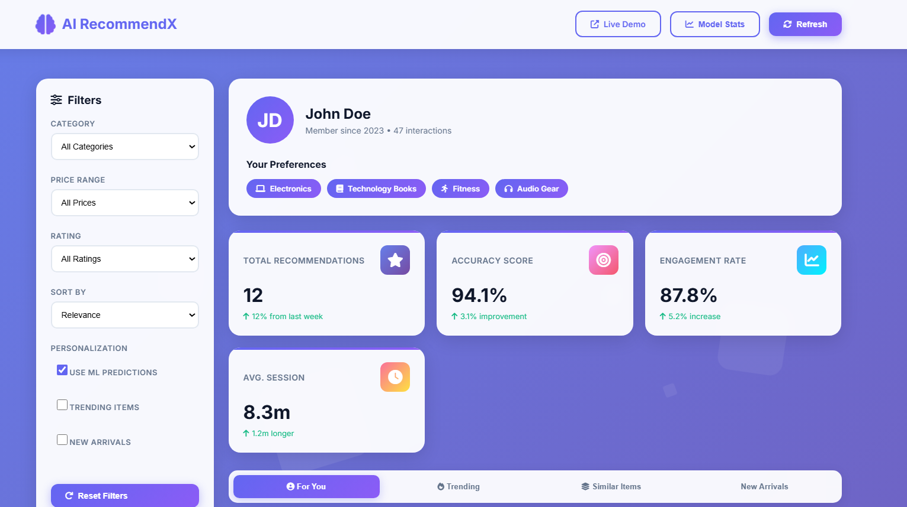
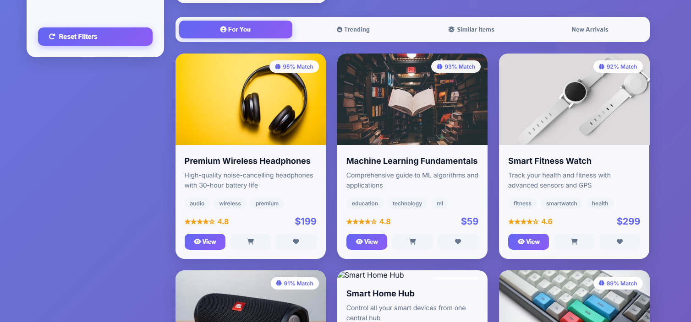

# AI Real-Time Recommendation & Personalization Engine Web App

## Overview
This web application demonstrates a real-time recommendation and personalization engine with a sleek, modern user interface. The app includes advanced filtering, analytics dashboard, user interaction tracking, and animated visual effects.

---

---

## Features
- Real-time recommendation scoring and personalized suggestions
- Multiple filter and sorting options (category, rating, price)
- Detailed product view with add-to-cart and feedback options
- Live analytics dashboard with accuracy, precision, recall, and F1 metrics
- User activity feed displaying real-time actions and engagements
- Responsive design with animations and glassmorphism UI styling
- Simulated ML model predictions with confidence scores 

